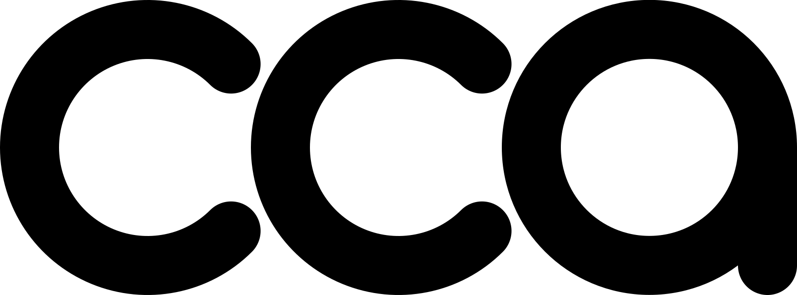
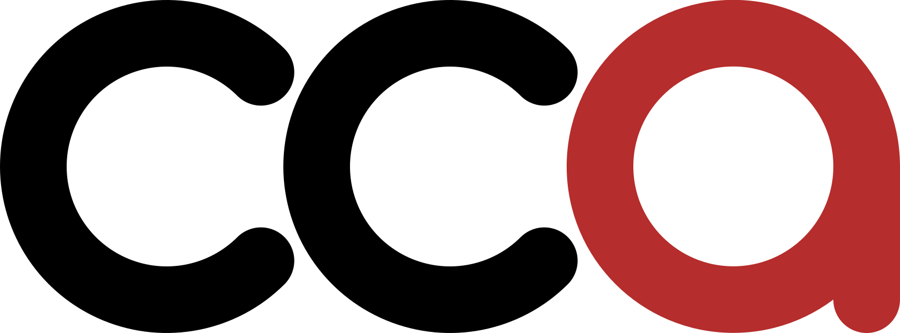

# Creative Coding Amsterdam

* [Website](https://cca.codes)
* [Meetup group](https://www.meetup.com/creative-coding-amsterdam/)
* [Discord](https://discord.gg/eJJvn3487M)

## Logo

You can find all of the files [here](./logo/).

### SVG

||Plain|With red accent|
|-|-|-|
|Black|||
|White|||

### PNG

||Plain|With red accent|
|-|-|-|
|Black|||
|White|||

## Website

For the website use [Zola](https://www.getzola.org/) static site generator. All of the files are in [website](./website) folder.

To run the site locally:

- [Install Zola](https://www.getzola.org/documentation/getting-started/installation/)
- Navigate to [website](./website) folder in your terminal
- Run `zola serve` (if you want to test it on your local network add `--interface 0.0.0.0`)
- Open [localhost:1111/](http://localhost:1111/)

Deployments are automated using [GitHub actions](./.github/workflows/gh-pages.yaml) and deployed to GitHub Pages.

### TODO

* [x] Setup CI
* [x] Basic documentation
* [ ] Collaboration document
* [x] Add title to the homepage
* [x] Add title to the invaders page
* [x] Spotlight item data model
* [ ] Remove spotlight URLs from sitemap.xml
* [ ] Pause button on the spotlight video
* [ ] Page template
* [ ] Events page
* [ ] About page
* [ ] Code challenge template (maybe reuse the page template)
* [ ] Clean up / organize SCSS a bit better (WIP)
* [ ] Contact modal - switch to discrete transitions instead of animations
* [ ] Dark theme
